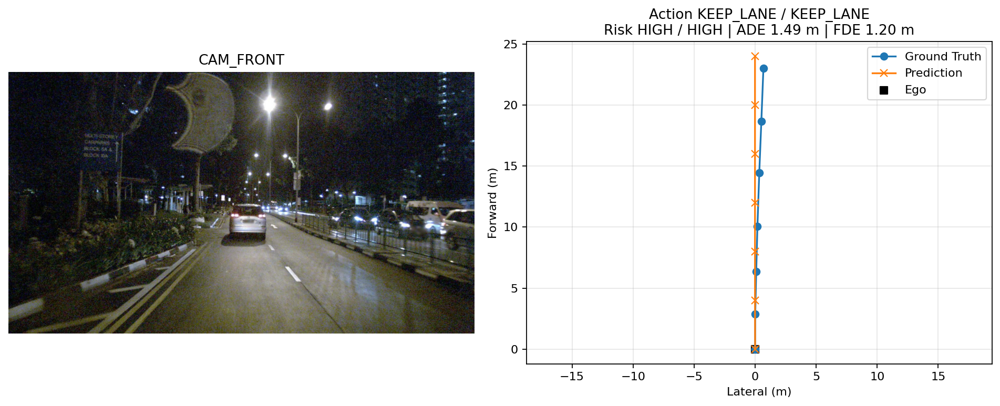

# DriveVLA-SFT-8B

基于 `Qwen/Qwen3-VL-8B-Instruct + 4bit QLoRA` 的自动驾驶
Vision-Language-Action 微调项目。项目先用本地 `nuScenes-mini` 跑通完整闭环，
随后扩展到本地 `nuScenes trainval` 相机数据。主训练由 LLaMA-Factory 完成，
推理、输出解析、ADE/FDE、轨迹几何分析、可视化和失败分析由项目自行实现；
模型输出还接入 CARLA Pure Pursuit/PID 控制闭环，用于验证离线指标之外的安全问题。

当前工程包含四条可复现链路：

1. nuScenes scene 级数据构建与弱监督标签生成；
2. Qwen3-VL-8B 单卡 4bit QLoRA SFT 与 DPO；
3. 结构化输出、离散动作、连续轨迹和目标速度评估；
4. CARLA 异步规划、轨迹控制、fallback 与多 seed 能力场景评测。

## 项目动机

普通 VQA 只需要描述图像，本项目要求模型把视觉和语言条件转换为可评估的驾驶
Action、Risk 和连续轨迹。重点不是声称小数据模型可以直接控制车辆，而是完成
“数据构建、真实 8B QLoRA、结构化生成、离线指标、可视化和失败分析”的工程闭环。

## 任务定义

输入：

- `CAM_FRONT` 前视相机图像；
- 自然语言驾驶指令；
- 车辆、行人和障碍物等场景统计。

输出严格 JSON：

```json
{
  "action": "KEEP_LANE",
  "risk": "HIGH",
  "trajectory": [[4.51, -0.01], [9.32, 0.01], [13.52, 0.08], [17.59, 0.17], [21.07, 0.25], [24.82, 0.38]],
  "reason": "保持当前车道并平稳前进；周边交通参与者密集，需要谨慎决策。",
  "target_speed_mps": 8.28
}
```

`trajectory` 是当前自车坐标系下未来 6 个关键帧的
`[forward_m, lateral_m]`。Risk 来自交通参与者数量的 heuristic 弱监督，
不是 nuScenes 人工风险标注。`target_speed_mps` 是 v6 新增的可选监督字段，
旧版模型仍保持四字段输出。

## 已构建数据

项目包含两个数据阶段：`nuScenes-mini` 只用于早期链路验证，后续正式 QLoRA
实验使用本地 `Full_dataest` 中的 `v1.0-trainval` 数据。以下结果不要混为同一
规模的数据集。

### nuScenes-mini 链路验证

数据源：`/home/pc/datasets/nuscenes`

| Split | Samples | Scenes |
|---|---:|---:|
| Train | 310 | 9 |
| Validation | 34 | 1 |
| Total | 344 | 10 |

训练集和验证集按 scene 划分且无交集，scene 尾部不足 6 个未来帧的样本直接跳过。
六点未来轨迹的平均累计路程为 16.78 米。
完整分布见
[`data/nuscenes_vla_sft/dataset_report.md`](data/nuscenes_vla_sft/dataset_report.md)。

### nuScenes trainval 正式实验

第二阶段使用 `/home/pc/datasets/Full_dataest` 下完整 `trainval` 元数据和本地
可用的 `CAM_FRONT` 图像，输出到
`data/nuscenes_vla_sft_trainval`。该目录成功转换 23349 条样本，其中训练集
21030 条、验证集 2319 条。由于本地数据目录缺少部分 `CAM_FRONT` 图像，转换时
跳过 5700 条缺图样本；scene 末尾不足未来 6 帧的样本跳过 5100 条。

v6 在相同 full trainval scene split 上保留 3 个历史 ego 关键帧，并根据当前及
过去的 `sample_annotation` 增加目标纵向速度、相对速度、closing speed 与 TTC。
目标运动输入只沿 `annotation.prev` 读取历史标注，不读取未来目标状态；未来 ego
轨迹仅用于生成 assistant 监督，避免答案泄漏。

| v6 Split | Samples |
|---|---:|
| Train | 19,182 |
| Validation | 2,115 |
| Total | 21,297 |

v6 共记录 166,368 个最近目标，历史速度可计算率为 98.74%，其中 12,268 个
前方接近目标可计算 TTC。完整统计见
[`data/nuscenes_vla_sft_trainval_v6_safety/dataset_report.md`](data/nuscenes_vla_sft_trainval_v6_safety/dataset_report.md)。

## 环境

所有命令使用 Conda 环境 `drivevla_sft`。当前验证环境：

- Python 3.10.20；
- PyTorch 2.12.0 + CUDA 13.0；
- Transformers 4.57.1；
- PEFT 0.17.1；
- bitsandbytes 0.49.2；
- RTX 5090 32 GB，支持 bf16。

先执行：

```bash
env -u PYTHONPATH PYTHONNOUSERSITE=1 \
  /home/pc/miniconda3/envs/drivevla_sft/bin/python \
  scripts/check_environment.py
```

本机终端带有 Isaac Sim 的外部 `PYTHONPATH`，所以项目命令显式移除该变量，
防止错误导入其他 Conda 环境中的包。

项目内 LLaMA-Factory 固定到支持 Python 3.10 和 Qwen3-VL 的提交：

```bash
git clone https://github.com/hiyouga/LLaMA-Factory.git third_party/LLaMA-Factory
cd third_party/LLaMA-Factory
git checkout --detach b44f651e0905fed54f9455acd25bc2cfed8f1b94
env -u PYTHONPATH PYTHONNOUSERSITE=1 \
  /home/pc/miniconda3/envs/drivevla_sft/bin/python \
  -m pip install -e ".[torch,metrics]"
```

## 数据构建

```bash
env -u PYTHONPATH PYTHONNOUSERSITE=1 \
  /home/pc/miniconda3/envs/drivevla_sft/bin/python \
  scripts/convert_nuscenes_to_qwen3vl.py \
  --nuscenes_root /home/pc/datasets/nuscenes \
  --output_dir data/nuscenes_vla_sft \
  --train_ratio 0.9 \
  --future_steps 6 \
  --camera CAM_FRONT
```

注册到项目内的 LLaMA-Factory：

```bash
env -u PYTHONPATH PYTHONNOUSERSITE=1 \
  /home/pc/miniconda3/envs/drivevla_sft/bin/python \
  scripts/register_llamafactory_dataset.py
```

## QLoRA 训练

先执行 32 条样本、2 step 的冒烟训练：

```bash
cd third_party/LLaMA-Factory
env -u PYTHONPATH PYTHONNOUSERSITE=1 \
  CONDA_DEFAULT_ENV=drivevla_sft \
  HF_HUB_DISABLE_XET=1 \
  TOKENIZERS_PARALLELISM=false \
  /home/pc/miniconda3/envs/drivevla_sft/bin/llamafactory-cli \
  train ../../configs/qwen3vl_8b_qlora_smoke.yaml
```

冒烟通过后运行正式 3 epoch：

```bash
cd third_party/LLaMA-Factory
env -u PYTHONPATH PYTHONNOUSERSITE=1 \
  CONDA_DEFAULT_ENV=drivevla_sft \
  HF_HUB_DISABLE_XET=1 \
  TOKENIZERS_PARALLELISM=false \
  /home/pc/miniconda3/envs/drivevla_sft/bin/llamafactory-cli \
  train ../../configs/qwen3vl_8b_qlora.yaml
```

正式配置使用 NF4 4bit、bf16、LoRA rank 16、batch size 1、梯度累积 8、
学习率 `1e-4` 和 3 epoch，并冻结视觉塔与多模态投影层。

本机真实训练结果：

- 可训练参数：43,646,976，占总参数 0.4954%；
- 117 个 optimizer step，训练耗时 345.7 秒；
- 最终 train loss：0.4039；
- 最终 eval loss：0.4186；
- 训练峰值显存约 24.7 GB。

另开终端可观察显存和利用率：

```bash
watch -n 1 nvidia-smi
```

训练成功的基本判断是：loss 能持续记录、输出目录包含
`adapter_config.json` 和 adapter 权重、训练进程正常结束，并且 adapter 能重新
加载生成结果。若 OOM，按顺序降低 `image_max_pixels`、`cutoff_len` 和
`lora_rank`，不要直接改成全参数训练。

trainval 阶段沿用相同 QLoRA 策略，训练配置见
[`configs/qwen3vl_8b_qlora_trainval.yaml`](configs/qwen3vl_8b_qlora_trainval.yaml)。
本机 3 epoch 真实训练结果：

- 训练样本 21030，验证样本 2319；
- 7887 个 optimizer step，训练耗时 6 小时 54 分；
- 最终 train loss：0.3218；
- 最终 eval loss：0.3380。

针对 trainval v1 暴露出的 `SLOW_DOWN` 弱和轨迹偏直问题，已生成 v2 数据并通过
2 step 冒烟训练：

- v2 数据目录：`data/nuscenes_vla_sft_trainval_v2`；
- 动作标签规则：`--action-rule v2`；
- 训练集均衡后样本：19135，每类 action 3827 条；
- 验证集保持 scene split 真实分布，其中 `SLOW_DOWN` 为 360 条；
- 冒烟配置：[`configs/qwen3vl_8b_qlora_trainval_v2_smoke.yaml`](configs/qwen3vl_8b_qlora_trainval_v2_smoke.yaml)；
- 短对照配置：[`configs/qwen3vl_8b_qlora_trainval_v2_short.yaml`](configs/qwen3vl_8b_qlora_trainval_v2_short.yaml)。

v2 短训练显示强均衡采样会让 action 和轨迹几何退化；v3 去掉强均衡后，
Action Acc 恢复到 70.50%，但前 200 条验证样本中预测近似直线比例升到
73.50%，且没有预测出 `SLOW_DOWN`。

因此新增 v4 温和采样组：保留 `--action-rule v2`，只把 `SLOW_DOWN`
采样到 7000 条、`TURN_LEFT` 和 `TURN_RIGHT` 分别采样到 3000 条，KEEP_LANE
和 STOP 保持原始训练数量。v4 数据位于
`data/nuscenes_vla_sft_trainval_v4_mildsample`，2 step 冒烟训练和 1000 step
短对照均已完成。v4 在前 200 条验证样本上 ADE/FDE 为 2.2551 m / 3.9832 m，
预测近似直线比例从 v3 的 73.50% 降到 64.50%，但 Action Acc 下降到 62.00%，
且 `SLOW_DOWN` 只正确 2/17。结论是：采样能让模型更敢输出低频动作，但还不足以
学到可靠的减速判据。

v5 进一步加入历史 ego motion，而不是继续调采样。每条样本读取当前帧之前 3 个
关键帧，在 prompt 中加入历史速度、当前速度、历史加速度、历史 yaw 变化和横向
位移趋势；动作弱标签使用 `--action-rule v3`，让 `SLOW_DOWN` 更依赖真实速度
下降趋势。v5 数据位于 `data/nuscenes_vla_sft_trainval_v5_history`，共 21297
条样本，训练 19182 条、验证 2115 条。2 step 冒烟训练和 1000 step 短对照均已
完成。v5 在前 200 条验证样本上 ADE/FDE 降到 0.9097 m / 2.0478 m，预测近似
直线比例降到 47.50%，是目前轨迹拟合最好的版本；但 Action Acc 只有 59.00%，
其中 `SLOW_DOWN` 仅 1/30，说明历史运动显著改善连续轨迹，但动作枚举仍需要更
细的速度意图监督。

v5 随后完成 3 epoch 全量训练，并在全部 2115 条 scene 隔离验证样本上评估：

| Parse Success | Action Acc | Risk Acc | Trajectory Valid | ADE (m) | FDE (m) |
|---:|---:|---:|---:|---:|---:|
| 99.95% | 74.94% | 95.32% | 100.00% | 0.6908 | 1.5071 |

完整验证中预测近似直线比例为 45.67%，预测二阶差分均值为 0.0836，仍低于
GT 的 0.2015。这里的“弯曲度”是轨迹点二阶差分诊断量，不是严格物理曲率。

v6 在 v5 基础上补充目标动态信息和 `target_speed_mps` 监督。32 条样本、2 step
的 4bit QLoRA 冒烟训练已经通过，train loss 为 1.2888，adapter 可以正常保存。
正式配置见
[`configs/qwen3vl_8b_qlora_trainval_v6_safety_full.yaml`](configs/qwen3vl_8b_qlora_trainval_v6_safety_full.yaml)，
3 epoch full trainval 训练正在进行；在训练和完整评估结束前不填写 v6 正式指标。

## 离线偏好优化

在不接入 CARLA/VERL 的阶段，项目实现了一个可复现的离线数据飞轮：

1. 从 v5 SFT 训练集按动作分层抽样，并检查与最终验证 scene 无交集；
2. 用冻结 SFT 生成 rejected，使用数据集真实结构化答案作为 chosen；
3. 按格式、动作、ADE/FDE 和转弯几何筛选困难样本；
4. 使用 LLaMA-Factory 做单卡 4bit DPO；
5. 在同一独立验证子集上成对比较 SFT 与 DPO。

由于 RTX 5090 32 GB 无法同时放入两个 8B 4bit 模型，先把 v5 SFT adapter
合并到 bf16 基座，再加载一个新的 DPO LoRA。LLaMA-Factory 计算 reference
log-prob 时临时禁用新 adapter，因此 reference 仍是冻结 SFT，而不是原始 base。

已完成 512 个候选、372 对偏好数据、336/36 train/val 的两轮真实 pilot：

| Model | Action Acc | ADE (m) | FDE (m) | 近似直线比例 |
|---|---:|---:|---:|---:|
| merged SFT | 64.00% | 0.8371 | 1.8579 | 41.00% |
| DPO，完整 SFT 输出作 rejected | 63.50% | 0.8439 | 1.8895 | 35.50% |
| DPO，单字段隔离 rejected | 64.00% | 0.8477 | 1.8797 | 42.00% |

两轮 DPO 都学会了区分训练偏好，但没有改善独立验证主指标，因此当前 adapter
只作为实验产物，不替代 v5 SFT。这个负结果说明 336 对偏好样本的泛化不足，
也说明离线 DPO 不是环境交互闭环。完整执行步骤和放大条件见
[`docs/06_dpo_preference_optimization.md`](docs/06_dpo_preference_optimization.md)。

## 自写评估

训练后分别对 base 和 adapter 运行：

```bash
env -u PYTHONPATH PYTHONNOUSERSITE=1 \
  /home/pc/miniconda3/envs/drivevla_sft/bin/python \
  scripts/infer_drivevla.py --model-label base \
  --output-path results/predictions_base.jsonl

env -u PYTHONPATH PYTHONNOUSERSITE=1 \
  /home/pc/miniconda3/envs/drivevla_sft/bin/python \
  scripts/infer_drivevla.py --model-label qlora \
  --adapter-path results/qwen3vl_8b_drivevla_qlora \
  --output-path results/predictions_finetuned.jsonl
```

评估链路包括：

- 严格 JSON、code fence、对象提取和旧格式正则四级解析；
- Parse Success、Action Accuracy、Risk Accuracy、Trajectory Valid；
- 六点轨迹 ADE、FDE 和轨迹几何弯曲度；
- v6 `target_speed_mps` 有效率与 Target Speed MAE；
- 失败案例分类、Markdown 报告和图像/轨迹可视化。

## 实验结果

以下结果来自同一组 34 条 scene 隔离验证样本、相同 4bit 推理和 greedy decoding：

| Model | Parse Success | Action Acc | Risk Acc | Trajectory Valid | ADE (m) | FDE (m) |
|---|---:|---:|---:|---:|---:|---:|
| Qwen3-VL-8B Base | 0.00% | 0.00% | 0.00% | 100.00% | 5.7259 | 9.7330 |
| Qwen3-VL-8B + QLoRA | 100.00% | 47.06% | 79.41% | 100.00% | 2.9181 | 5.5081 |

相对 Base，QLoRA 将 ADE 降低 49.04%，FDE 降低 43.41%。Base 能生成六点
数值轨迹，但 Action/Risk 使用中文自由文本而不是规定枚举，因此严格解析、
Action Accuracy 和 Risk Accuracy 均记为 0；这正是结构化 SFT 带来的核心改进。

完整结果见：

- [Base 与 QLoRA 对比](results/base_vs_qlora.md)
- [QLoRA 指标](results/finetuned_eval_report.md)
- [QLoRA 失败分析](results/finetuned_failure_analysis.md)

扩展到 trainval 后，在完整 2319 条验证集上，模型不再塌缩到
`KEEP_LANE` / `STOP`，能够稳定预测左右转：

| Model | Samples | Parse Success | Action Acc | Risk Acc | ADE (m) | FDE (m) |
|---|---:|---:|---:|---:|---:|---:|
| Qwen3-VL-8B + QLoRA trainval | 2319 | 99.83% | 80.42% | 95.34% | 2.2574 | 3.9219 |

分动作准确率显示，`TURN_LEFT` 为 67.96%，`TURN_RIGHT` 为 71.60%，但
`SLOW_DOWN` 只有 12.70%。这说明第二阶段已经解决 mini 阶段的动作塌缩，
但低频速度类动作仍然需要更清晰的标签和采样策略。

进一步的轨迹几何分析发现，模型虽然能预测转向动作，但连续轨迹存在过度平滑：

- GT 平均弯曲度：0.2023；
- Prediction 平均弯曲度：0.1085；
- 预测近似直线比例：33.00%。

完整记录见：

- [trainval 完整评估摘要](results/trainval_finetuned_full_summary.md)
- [trainval 轨迹几何分析](results/trainval_finetuned_full_trajectory_geometry.md)

## CARLA 闭环评测

项目将结构化六点轨迹接入 Pure Pursuit 横向控制和 PID 纵向控制，并实现异步
Qwen 推理、轨迹超时检测、路线 fallback、碰撞/车道侵入传感器及逐帧 JSONL 日志。
v5 首轮基线完成 5 类能力场景乘 5 个 seed，共 25 次运行：

- 总体碰撞运行：3/25，全部发生在静止前车场景；
- 静止前车碰撞运行率 60%，安全停车成功率 0%；
- 自然弯道路线完成率 61.92%±4.60%，平均车道侵入 3.60 次；
- 平均 fallback 占比 28.89%，因此闭环结果不能全部归因于 VLA 模型。

该实验暴露了离线 ADE/FDE 无法直接反映的过度停车、目标运动不可观测、推理延迟
和横向控制问题。v6 已在在线 prompt 与逐帧日志中加入目标相对速度、TTC 和预测
目标速度接口，待正式 adapter 完成后按同一场景与 seed 做严格对照。聚合结果见
[`results/carla/generalization/capability_generalization_summary.md`](results/carla/generalization/capability_generalization_summary.md)。

## 可视化

下图同时显示原始 `CAM_FRONT`、真实六点轨迹和 QLoRA 预测轨迹：



项目共生成 Base 与 QLoRA 各 20 张轨迹图。QLoRA 的主要失败模式是把验证集
中的 TURN_LEFT 预测为 KEEP_LANE 或 STOP；它在 10 个 TURN_LEFT 样本上没有
预测出 TURN_LEFT，说明 344 条小数据和动作不均衡仍不足以学习稳定转弯决策。

## 教学版训练

[`scripts/train_qwen_vl_lora_minimal.py`](scripts/train_qwen_vl_lora_minimal.py)
只支持小数据、单卡和 batch size 1，用于展示：

- processor 与 chat template；
- 图像和文本联合编码；
- assistant-only loss mask；
- NF4 4bit 基座加载；
- LoRA adapter 挂载与保存。

它用于解释原理，不替代 LLaMA-Factory 的正式训练结果。
该脚本已用 2 条真实样本、1 个 optimizer step 完成 QLoRA 冒烟验证并成功保存
adapter。

## 文档

- [数据构建](docs/01_dataset.md)
- [QLoRA 微调](docs/02_qlora_finetuning.md)
- [自写评估](docs/03_evaluation.md)
- [失败分析](docs/04_failure_analysis.md)
- [下一步优化计划](docs/05_next_optimization.md)
- [DPO 离线偏好优化](docs/06_dpo_preference_optimization.md)
- [CARLA 闭环接入](docs/07_carla_closed_loop.md)
- [v6 时序安全输入](docs/08_v6_temporal_safety.md)

## 项目边界

nuScenes-mini 只有 10 个 scene，仅用于早期工程链路验证；项目的正式训练与主要
离线结论来自完整 nuScenes trainval 阶段。两阶段主要使用单目 `CAM_FRONT`，
且本地 full 数据缺少部分图像，因此不能将结果表述为使用了全部 nuScenes 传感器
和全部可用样本。CARLA 实验属于仿真闭环验证，目前只覆盖单一地图、天气和有限
场景参数，不代表真实车辆性能或完整域泛化。

## 后续方向

- 完成 v6 full trainval 评估，报告 Action/Risk、ADE/FDE 与 Target Speed MAE；
- 在完全相同 CARLA 场景和 seed 下对比 v5/v6 的碰撞率、最小 TTC 和 fallback；
- 基于 v6 闭环失败样本重新构造 chosen/rejected，再评估 DPO 是否改善独立安全指标；
- 引入地图/车道中心线或三前向相机，改善弯道轨迹形状；
- 扩展 CARLA 多地图、多天气和参数化前车场景，分别报告纯 VLA 输出、fallback
  使用率与最终闭环指标。
